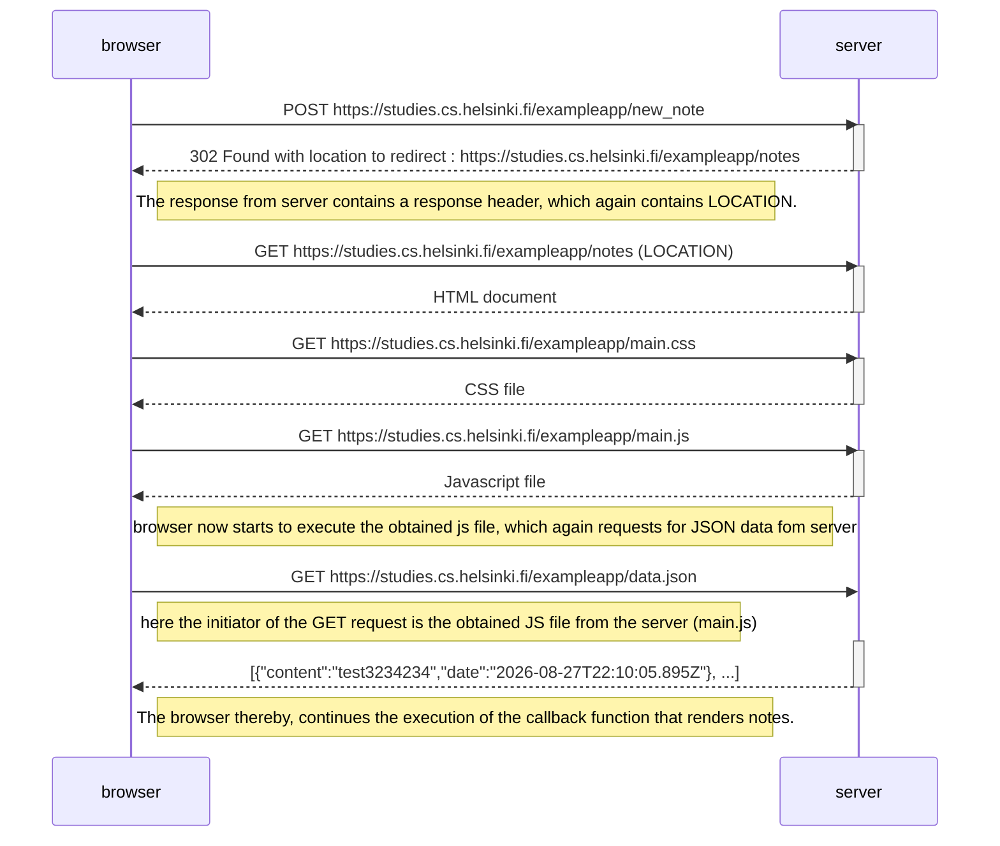

```mermaid
    sequenceDiagram
        participant browser
        participant server

        browser->>server: POST https://studies.cs.helsinki.fi/exampleapp/new_note
        activate server
        server-->>browser: 302 Found with location to redirect : https://studies.cs.helsinki.fi/exampleapp/notes
        deactivate server

        Note right of browser: The response from server contains a response header, which again contains LOCATION.

        browser->> server: GET https://studies.cs.helsinki.fi/exampleapp/notes (LOCATION)
        activate server
        server-->>browser: HTML document
        deactivate server

        browser->> server: GET https://studies.cs.helsinki.fi/exampleapp/main.css
        activate server
        server-->> browser: CSS file
        deactivate server

        browser->> server: GET https://studies.cs.helsinki.fi/exampleapp/main.js
        activate server
        server-->> browser: Javascript file
        deactivate server

        Note right of browser: browser now starts to execute the obtained js file, which again requests for JSON data fom server

        browser->> server: GET https://studies.cs.helsinki.fi/exampleapp/data.json
        Note right of browser: here the initiator of the GET request is the obtained JS file from the server (main.js)
        activate server
        server -->> browser: [{"content":"test3234234","date":"2026-08-27T22:10:05.895Z"}, ...]
        deactivate server

        Note right of browser: The browser thereby, continues the execution of the callback function that renders notes.
```