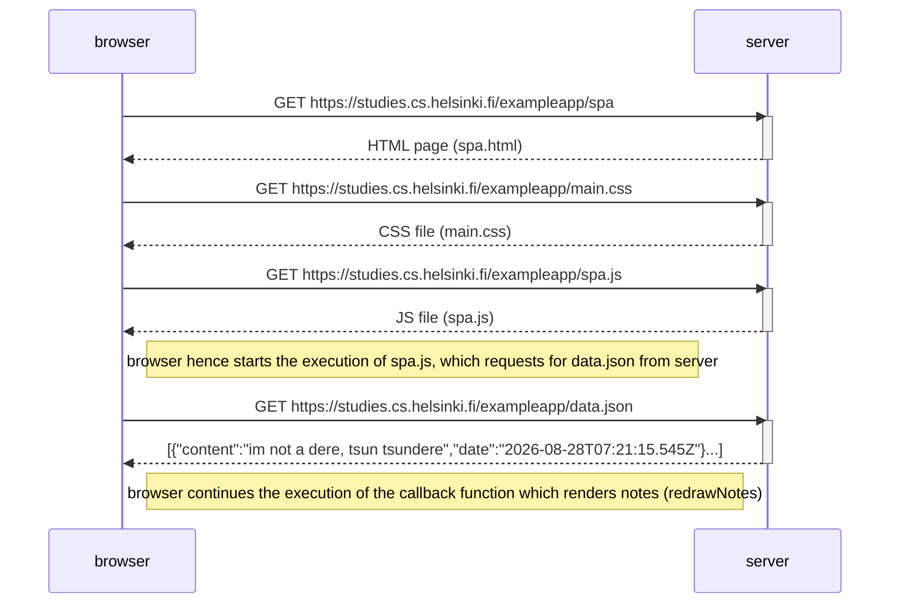

```mermaid
    sequenceDiagram

    participant browser
    participant server

    browser ->> server: GET https://studies.cs.helsinki.fi/exampleapp/spa
    activate server
    server -->> browser: HTML page (spa.html)
    deactivate server

    browser ->> server: GET https://studies.cs.helsinki.fi/exampleapp/main.css
    activate server
    server -->> browser: CSS file (main.css)
    deactivate server

    browser ->> server: GET https://studies.cs.helsinki.fi/exampleapp/spa.js
    activate server
    server -->> browser: JS file (spa.js)
    deactivate server

    Note right of browser: browser hence starts the execution of spa.js, which requests for data.json from server

    browser ->> server: GET https://studies.cs.helsinki.fi/exampleapp/data.json
    activate server
    server -->> browser: [{"content":"im not a dere, tsun tsundere","date":"2026-08-28T07:21:15.545Z"}...]
    deactivate server

    Note right of browser: browser continues the execution of the callback function which renders notes (redrawNotes)
```