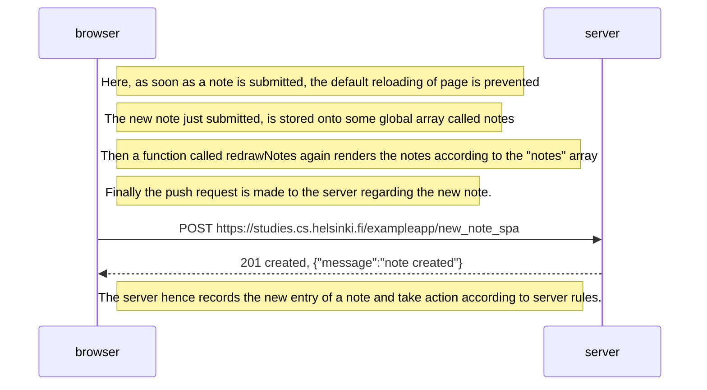

```mermaid
    sequenceDiagram

    participant browser
    participant server

    Note right of browser: Here, as soon as a note is submitted, the default reloading of page is prevented
    Note right of browser: The new note just submitted, is stored onto some global array called notes
    Note right of browser: Then a function called redrawNotes again renders the notes according to the "notes" array
    Note right of browser: Finally the push request is made to the server regarding the new note.
    browser ->> server: POST https://studies.cs.helsinki.fi/exampleapp/new_note_spa

    server -->> browser: 201 created, {"message":"note created"}
    Note right of browser: The server hence records the new entry of a note and take action according to server rules.
```